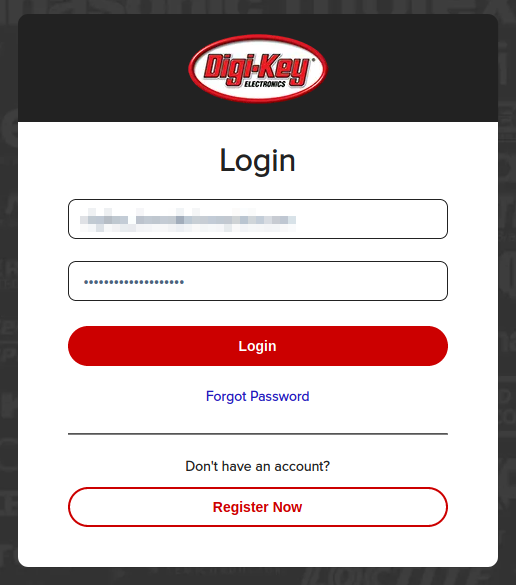
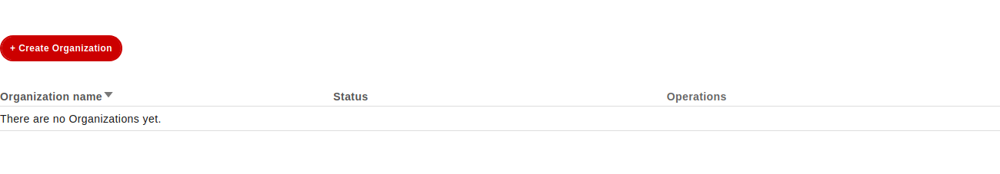
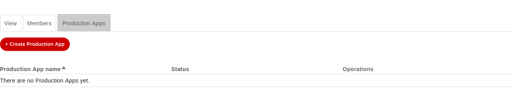
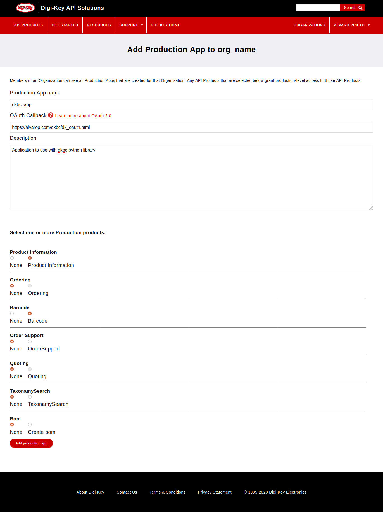
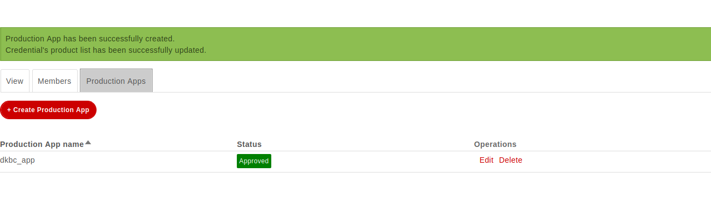
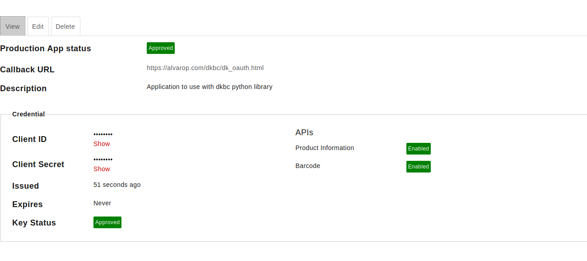
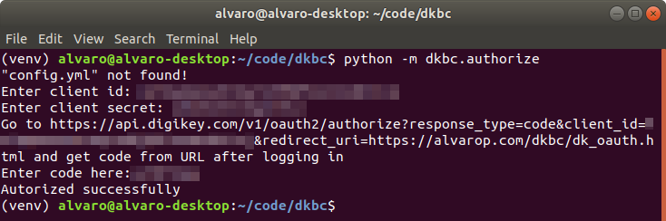
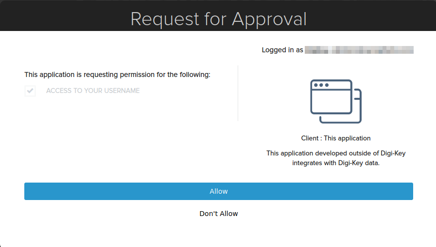
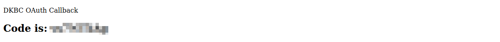

# Digi-key Api Tools

These are just a few scripts I wrote to look up part information from Digi-key barcodes as well as look up parts by number. I then use this information to create new, simplified, barcodes for my inventory system.

Currently, it supports the barcode search API (1D and 2D barcodes) as well as the part search API. I need to document it all, but it should help get you started if you want to play with the Digi-Key API in python.

## Getting Started
dkbc uses the official Digi-Key API. In order to use it, you'll need to register on https://developer.digikey.com. You can use your existing Digi-Key account as well.

Once registered, you'll need to login and create an organization and application.



To create an organization, go to (https://developer.digikey.com/teams) and click on "Create Organization"



Once created, click on "production apps" for the newly created organization



Create production app
You can use https://alvarop.com/dkbc/dk_oauth.html as an OAuth Callback URL
Select Product Information and Barcode support



Click on the new application to get client id and client secret (which will be used for authorization next.)





Before continuing, you need to setup your python environment (using [virtualenv](https://virtualenv.pypa.io) in this case)

```
virtualenv venv
source venv/bin/activate
pip install -e .
```

Now that the environment is configured, you need to get an authorization code from Digi-Key to enable API access. There's a helper script to do it.

Run `python -m dkbc.authorize`. It will ask you for your client id and client secret. These can be found in your application details from earlier.



After entering the client id and secret, your web browser should automatically open to the Digi-Key website. If you're not logged in, log in again. It will ask for approval for your organization. Click on Allow.



You will now be redirected to the OAuth callback URL, which will show the authorization code.



That's it! You should be ready to run the examples (or write your own scripts!)

## Scanning barcodes
* Run `python examples/scan.py`

## Manually entering part numbers for search
* Run `python examples/search.py`
